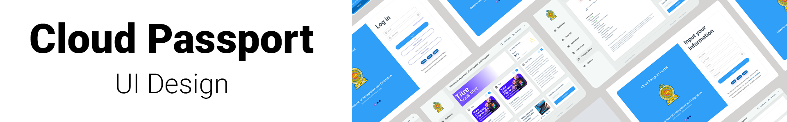

#  

 

***Cloud-Online-Passport-Application For Automate the Passport processing***

# Cloud-Online-Passport-Application-UI

This project aims to automate the manual process of passport application in Sri Lanka and simplify the passport application process for citizens. The Department of Immigration and Emigration of Sri Lanka has been facing management and handling issues due to the increasing number of new passport applicants. The department does not have adequate staff to handle the rise in new applicants, resulting in discomfort for applicants, especially those from rural areas who must face these difficulties for days.

To address this situation, we have developed a web-based system that allows citizens to apply for passports online, reducing the need for physical visits to government offices. This system will significantly improve the passport application process and enhance the overall experience for applicants.

## Project Details

The UI is developed using modern UI/UX Concepts & theories like Shneiderman and Norman's .

## Shneiderman's Eight Golden Rules for UI Design

In the development of this UI, we have followed Shneiderman's Eight Golden Rules for UI design, which include:

1. Strive for consistency
2. Enable frequent users to use shortcuts
3. Offer informative feedback
4. Design dialogs to yield closure
5. Offer simple error handling
6. Permit easy reversal of actions
7. Support internal locus of control
8. Reduce short-term memory load

By adhering to these design principles, we have created a UI that is not only visually appealing but also easy to use and navigate. 

## Figma Design

You can view the design for this project on Figma [here](https://www.figma.com/file/Q3faTBapseE4oaNYFJ1BzT/Public-User-UI?t=LEj07eQe9DsDWX5L-1).

## License

This project is licensed under the MIT License. See the LICENSE file for more information.
